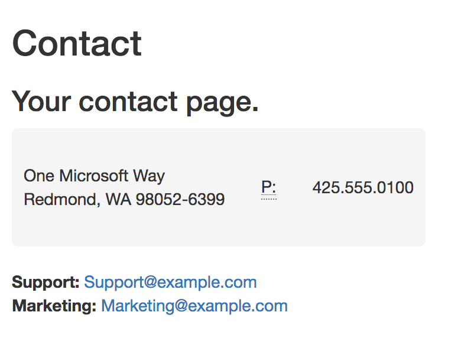

# ASP.NET Core Tag Helper Components

### Overview

In theory, a tag helper component is really just a plain old tag helper. The main difference point is a tag helper component lets you modify/add `HTML` elements from server side code. ASP.NET Core ships with two built-in tag helper components i.e. `head` and `body`. They can be used both in MVC and Razor Pages. Following is the code for the built-in `head` tag helper component.

```
[HtmlTargetElement("head")]
[EditorBrowsable(EditorBrowsableState.Never)]
public class HeadTagHelper : TagHelperComponentTagHelper
{
	public HeadTagHelper(ITagHelperComponentManager manager, ILoggerFactory loggerFactory)
            : base(manager, loggerFactory)
	{
	}
}
```

* A custom tag helper component class inherits from the `TagHelperComponentTagHelper` base class. 
* With `[HtmlTargetElement]` attribute, you can target any `HTML` element by passing the element name as a parameter. 
* `[EditorBrowsable]` attribute decides whether to show a type information in the IntelliSense or not. This is an optional attribute.
* `ITagHlperComponentMananger` manages a collection of tag helper components used throughout the application.

The `head` and `body` tag helper components are declared in the `Microsoft.AspNetCore.Mvc,TagHelpers` namespace like other tag helpers. In a MVC/Razor Pages application, all tag helpers are imported with the `@addTagHelper` directive in `_ViewImports.cshtml` file.

*_ViewImports.cshtml*

```
@addTagHelper *, Microsoft.AspNetCore.Mvc.TagHelpers
```

### Use Cases

*`head` tag helper component*

A typical usage of `<head>` element is that you can define page wide markup styles with `<style>` element. The following code dynamically adds styles in the `<head>` element using the `head` tag helper component.

```
public class StyleTagHelperComponent : ITagHelperComponent
{
	private string style = "<style>" +
		"address[navigable] { display: flex;" +
		"justify-content: space-between;" +
		"width: 350px;" +
		"background: whitesmoke;" +
		"height: 100px;" +
		"align-items: center;" +
		"padding: 0 10px;" +
		"border-radius: 5px; }" +
		"</style>";

	public int Order => 1;

	public void Init(TagHelperContext context) { }

	public Task ProcessAsync(TagHelperContext context, TagHelperOutput output)
	{
		if (string.Equals(context.TagName, "head", StringComparison.OrdinalIgnoreCase))
		{
			output.PostContent.AppendHtml(style);            
		}
		
	   	return Task.CompletedTask;
	}
}
```

* `StyleTagHelperComponent` implements `ITagHelperComponent`. The abstraction allows the class to be initialized with a `TagHelperContext`. It also make sure it can use tag helper components to add/modify `HTML` elements.
* If you have multiple usage of tag helper components in an application, `Order` defines the rendering order of the components.
* `ProcessAsync()` checks for a `TagName` inside the running context that matches the `head` element. If matched, it appends the content of the `_style` field with the `output` of the `<head>` element.



*`body` tag helper component*

Similarly, you can use the `body` tag helper component to inject js scripts inside your `<body>` element. Following code demonstrates such example,

*ScriptTagHelperComponent.cs*

```
public class ScriptTagHelperComponent : ITagHelperComponent
{      
	public int Order => 2;

	public void Init(TagHelperContext context) { }

	public async Task ProcessAsync(TagHelperContext context, TagHelperOutput output)
	{
		if (string.Equals(context.TagName, "body", StringComparison.OrdinalIgnoreCase)) 
		{
			var script = await File.ReadAllTextAsync("Files/AddressToolTipScript.html");
			output.PostContent.AppendHtml(script);
		}
	}
}
```

You can use separate `HTML` files to store your `scripts` and `styles` elements. It makes the code more cleaner and maintainable. The code above reads the content of `AddressToolTipScript.html` and appends it with the tag helper output. `AddressToolTipScript.html` file contains the following markup,

*AddressToolTipScript.html*

```
<script>
$("address[navigable]").hover(function() {
    $(this).attr({
        "data-toggle": "tooltip",
        "data-placement": "right",
        "title": "Home of Microsoft!"
     });
});
</script>
```

> The script dynamically adds a `bootstrap` tooltip menu on a `<address>` element with an attached attribute of `navigable`. The effect is visible when a mouse pointer hovers over the element.


### Dependency Injection

Implemented tag helper component classes must be registered with the dependency injection system if you are not managing the instances with `ITagHelperComponentManager`. Following code from `ConfigureServices` of `Startup.cs` registers both the `StyleTagHelperComponent` and `ScriptTagHelperComponent` with a `Transient` lifetime.

*Startup.cs*

```
public void ConfigureServices(IServiceCollection services)
{
	services.AddTransient<ITagHelperComponent, ScriptTagHelperComponent>();
	services.AddTransient<ITagHelperComponent, StyleTagHelperComponent>();
}
```

### Custom Tag Helper Components

You can build your own custom tag helper component; following the same technique used for the build-in `head` and `body` tag helpers. Following is a custom tag helper component that targets the `<address>` element.

*AddressTagHelperComponentTagHelper.cs*

```
[HtmlTargetElement("address")]
[EditorBrowsable(EditorBrowsableState.Never)]
public class AddressTagHelperComponentTagHelper : TagHelperComponentTagHelper
{
	public AddressTagHelperComponentTagHelper(ITagHelperComponentManager componentManager, ILoggerFactory loggerFactory)
        : base(componentManager, loggerFactory)
    {
    }
}
```

You can use the custom `address` tag helper component to inject `HTML` elements as following,

```
public class AddressTagHelperComponent : ITagHelperComponent
{
	string _navigableButton = "<button type='button' class='btn btn-info' onclick=\"window.open('https://www.google.com/maps/place/Microsoft+Way,+Redmond,+WA+98052,+USA/@47.6414942,-122.1327809,17z/')\">" +
		                        "<span class='glyphicon glyphicon-road' aria-hidden='true'></span>" +
		                      "</button>";
    
	public int Order => 3;

	public void Init(TagHelperContext context) { }

	public async Task ProcessAsync(TagHelperContext context, TagHelperOutput output)
    {
		if (string.Equals(context.TagName, "address", StringComparison.OrdinalIgnoreCase) && output.Attributes.ContainsName("navigable"))
        {
			var content = await output.GetChildContentAsync();
			output.Content.SetHtmlContent($"<div>{content.GetContent()}</div>{_navigableButton}");
        }
    }
}
```

* `ProcessAsync()` checks equality for the `TagName` with the `address` element.  If matched, it inject `HTML` markups to `<address>` elements with an attribute of `navigable`. 

### Managing components with `ITagHelperComponentManager`

You can register the `AddressTagHelperComponent` with the DI system like the other ones. However, you can also initialize and add the component directly from the `Razor` markup. `ITagHelperComponentManager` is used to add/remove tag helper components from the application. Following demonstrates such example,

*Contact.cshtml*

```
@using TagHelperComponentRazorPages.TagHelpers;
@inject Microsoft.AspNetCore.Mvc.Razor.TagHelpers.ITagHelperComponentManager manager;
@{
    string markup;

    if (DateTime.Now.DayOfWeek == DayOfWeek.Saturday || DateTime.Now.DayOfWeek == DayOfWeek.Sunday)
    {
        markup = "<i class='text-warning'>Office closed today!</i>";
    }
    else
    {
        markup = "<i class='text-info'>Office open today!</i>";
    }

    manager.Components.Add(new AddressTagHelperComponent(markup, 1));
}
```

* `manager` is an instance of the view injected `ITagHelperComponentManager`.
* `manager.Components.Add` adds the component to the application's tag helper component collection.

This technique is useful when you want to control the injected `markup` and `order` of the component execution directly from the razor view. 

`AddressTagHelperComponent` is modified to accommodate a constructor that accepts the `markup` and `order` parameters,

```
private readonly string _markup;
private readonly int _order;

public AddressTagHelperComponent(string markup = "", int order = 1)
{
	_markup = markup;
	_order = order;
}
```

Passed in markup is used in the `ProcessAsync` as following,

```
public async Task ProcessAsync(TagHelperContext context, TagHelperOutput output)
{
	if (string.Equals(context.TagName, "address", StringComparison.OrdinalIgnoreCase) && output.Attributes.ContainsName("navigable"))
    {
		var content = await output.GetChildContentAsync();
		output.Content.SetHtmlContent($"<div>{content.GetContent()}<br/>{_markup}</div>{_navigableButton}");
    }
}
```

